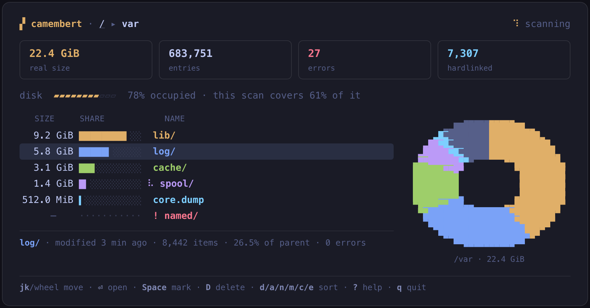

<div align="center">

# 🧀 camembert

**A disk usage analyzer that answers the real questions.**

*What grew? What can I actually free? What is big **and** cold?*

[](https://github.com/Haibread/camembert/actions/workflows/quality.yaml)
[](LICENSE-MIT)
[](https://www.rust-lang.org)

*(camembert is French for pie chart — yes, really)*

</div>

---

Every disk analyzer tells you what is big. **camembert** is built for the
questions you actually have during an incident:

- **What grew since yesterday?** — `camembert diff` two scans, sorted by
  growth, in streaming constant memory.
- **What can I actually free?** — freeable ≠ size: hardlinks are counted
  once and attributed deterministically; deleted-but-open files and btrfs
  shared extents are on the roadmap.
- **What is big *and* cold?** — size × age, visible at a glance.

And it is **honest about the numbers** other tools get wrong: hardlinks,
sparse files, unreadable directories (counted *and* located, never
silently missing), kernel pseudo-filesystems (`/proc` claims 128 TiB —
camembert never counts it), mount boundaries.

## The interface

A **dashboard cockpit** you can navigate *while the scan runs* — totals
fill in and re-sort live, and the donut wheel's slices grow in real time:

<div align="center">
  
</div>

The wheel is a real pie chart drawn in your terminal with sub-cell
pixels — sextants (2×3 per cell) on modern terminals, half-blocks
everywhere else. Each of the top children gets an **identity color**:
the same color paints its table row, its proportion bar, and its slice,
so your eye links them instantly. The palette is Tokyo-Night-family
truecolor with a full fallback ladder (256 → 16 → mono/ASCII) and
[`NO_COLOR`](https://no-color.org) support.

Everything you see is also clickable: table rows, wheel slices, the
breadcrumb, the errors card (see [Mouse](#mouse-interactive-mode) below)
— the keyboard map stays complete either way.

Table bars and the donut ease into position over ~150ms on navigation or
a sort keypress — never longer, and a scan's own live growth is left
alone (it already updates continuously). `--no-motion` (env `NO_MOTION`,
any value counts, even empty — same rule as `NO_COLOR`) disables this:
everything then snaps straight to its target value. Below 100 columns
the side wheel panel has nowhere to go, so a compact mini-donut takes
over the header line instead (not a click target, unlike the full
panel); `z` toggles **zen mode** — table only, no cards/gauge/wheel.

Three themes are available with `--theme`/env `THEME`: `tokyo-night`
(default), `light` (a Tokyo-Night-"day"-style variant for a light
background) and `high-contrast` (avoids mid-greys, usable on either
background). Errors stay the same coral family and the amber signature
accent stays recognizably amber in every theme. Pick a light terminal
and never say a word about it: an OSC 11 background query at startup
auto-selects `light` when nothing else chose a theme — see
[Configuration](#configuration) for the full precedence and the
`camembert.toml` config file.

## Install

From source (Rust stable, edition 2024):

```bash
git clone https://github.com/Haibread/camembert
cd camembert
cargo install --path camembert
```

Prebuilt static binaries (x86_64 + aarch64 musl) will ship with the
first release.

## Quick start

```bash
# Browse a directory interactively (default on a terminal)
camembert /var

# Summary mode: totals + top directories, no UI
camembert /var --no-ui --top 10

# Scan and write a dump — the interchange format everything builds on
camembert /var -o today.cmbt

# THE feature: what changed between two scans?
camembert diff yesterday.cmbt today.cmbt

# Monitoring probe: exit 1 if growth exceeds the threshold
camembert diff yesterday.cmbt today.cmbt --threshold 500M --json

# Already have ncdu exports? Bring them along — no rescan needed
camembert import old-ncdu-export.json -o old.cmbt
camembert diff old.cmbt today.cmbt
```

Every option is also an environment variable (`THREADS`,
`CROSS_FILESYSTEMS`, `TOP`, `NO_UI`, `OUTPUT`, `THRESHOLD`, `COLOR`,
`THEME`, `NO_MOTION`, `LOG_FILTER`, `LOG_FILE`, …) — see `camembert
--help` and `camembert <subcommand> --help` for the full reference,
including the interactive key map and the diff JSON schema.

## Keys (interactive mode)

| | |
| --- | --- |
| `↓`/`j` `↑`/`k` | move · `⏎`/`l` open · `⌫`/`h` up · `g`/`G` ends |
| `d` `a` `n` `m` `c` `e` | sort: disk (default) · apparent · name · mtime · items · **errors** (again = reverse) |
| `p` | toggle the apparent-size column |
| `Space` `u` `D` | mark for deletion · clear marks · delete (confirm with `y`) |
| `v` | review marked entries: a scrollable list, `Space` unmarks a row, `D` deletes from there too |
| `?` | keyboard/mouse cheatsheet (`?`/`Esc` closes) |
| `z` | toggle zen mode: table only — no metric cards, disk gauge or donut wheel |
| `q`/`Esc` | quit (cancels a running scan) |

**Deletion is guarded**: mark-then-confirm, mount points refused, every
entry re-checked (existence, file type, device) immediately before
removal — anything that changed since the scan is skipped, never
deleted. Symlinks are removed, never followed.

While at least one entry is marked, a one-line **basket strip** appears
above the footer (count + total size) — it disappears again once nothing
is marked, so browsing without ever marking anything never sees the
layout shift. **Toasts** in the top-right corner announce things that
*happened* rather than input being validated — a dump written, a
deletion finishing (with the space freed), the scan itself finishing
while you keep browsing — stacking and auto-dismissing after a few
seconds; they never cover the delete-confirmation dialog. Ordinary
keypress feedback (mark refusals, "nothing marked") stays a quick footer
note instead, right next to the key hints it explains.

## Mouse (interactive mode)

Mouse support is additive — every key above keeps working, nothing
requires the mouse:

| | |
| --- | --- |
| Click a row | select it |
| Click it again, or double-click any row | open it (like `⏎`) |
| Wheel over the table | scroll the cursor |
| Click a donut slice | open that child directly |
| Click a breadcrumb segment (header) | jump to that ancestor (like `⌫` repeated) |
| Click the `errors` metric card | sort by subtree error count (like `e`) |
| Move the mouse over a row | update the selection card below the table, without moving the keyboard cursor |

Moving the keyboard cursor reclaims the selection card from the mouse.

## Configuration

Beyond flags and environment variables, the interactive UI reads an
optional TOML config file at `$XDG_CONFIG_HOME/camembert/camembert.toml`
(falling back to `~/.config/camembert/camembert.toml` when
`XDG_CONFIG_HOME` is unset). A missing file is perfectly fine — nothing
here is required. All keys are optional:

```toml
theme = "tokyo-night"  # "tokyo-night" | "light" | "high-contrast"
color = "auto"         # "auto" | "always" | "never"
no_motion = false      # true disables micro-animations
```

An unparseable file, an invalid value, or an unrecognized key is never
fatal: camembert warns (visible with `--log-file`) and falls back to
defaults for whatever did not parse, then keeps going.

**Precedence**, for each of the three keys independently: the matching
**CLI flag > its environment variable > `camembert.toml` > built-in
default** — `--theme`/`--color`/`--no-motion` beat `THEME`/`COLOR`/
`NO_MOTION`, which beat the config file, which beats `tokyo-night`/
`auto`/motion-enabled.

`theme` gets one more step between the config file and the default: an
**OSC 11 terminal background query**. At startup, before the alternate
screen opens, camembert asks the terminal for its background color and
waits up to ~150ms for an answer; if the reported color's relative
luminance is above 0.5, the `light` theme is auto-selected. This only
ever runs when nothing above it (flag, env var, config file) already
picked a theme, is skipped outright on a non-terminal or `TERM=dumb`,
and treats "no answer in time" as dark — the same look as before this
feature existed. It can never block longer than the timeout and never
consumes more than that narrow slice of stdin.

## The dump format

`.cmbt` dumps are **JSON Lines in a seekable zstd container**
([spec](docs/format/dump-v1.md)) — versioned, crash-safe (written to
`.part`, renamed atomically), and readable with stock tools, no
camembert required:

```bash
zstdcat today.cmbt | jq -r 'select(.t == "d") | [.td, .path] | @tsv' \
  | sort -rn | head -5
```

Sibling order is raw-byte sorted, which is what makes `diff` a
streaming merge-join: two 10M-entry dumps diff in megabytes of RAM,
not gigabytes.

## Honest numbers

- **real** (`st_blocks × 512`, the default) vs **apparent** (`st_size`)
  are both always carried — sparse files and compression make them
  legitimately disagree.
- Hardlinked inodes count **once**, attributed to their canonical
  (smallest-path) link — deterministic across scans, so diffs never
  show phantom growth.
- Unreadable directories never abort a scan and never vanish: the
  summary lists exactly where reads failed; in the TUI, sort with `e`.
- Kernel pseudo-filesystems (`/proc`, `/sys`, cgroups…) are never
  descended into, even with `--cross-filesystems`.
- The disk gauge tells you how much of the *occupied* filesystem your
  scan actually covers — a total without context is half a lie.

## Roadmap

Scan engine, live TUI, dump v1, diff, ncdu import, and guarded deletion
are implemented. Next: the freeable column (deleted-but-open files,
btrfs shared extents), flat view and pattern aggregation, the filter
query language with a command palette, per-owner views, io_uring statx,
remote scan over ssh, and an HTML report export. The full design trail
lives in [`docs/design/`](docs/design/).

## Development

```bash
cargo test --workspace          # the suite (~130 tests)
pre-commit install              # fmt + clippy -D warnings + hygiene hooks
```

The workspace splits a pure core library
([`camembert-core/`](camembert-core/)) from the TUI/CLI frontend
([`camembert/`](camembert/)); design decisions are recorded in
[`docs/design/`](docs/design/) and are binding. See
[HANDOFF.md](HANDOFF.md) for the current project state.

## License

Dual-licensed under [MIT](LICENSE-MIT) or
[Apache-2.0](LICENSE-APACHE), at your option.
