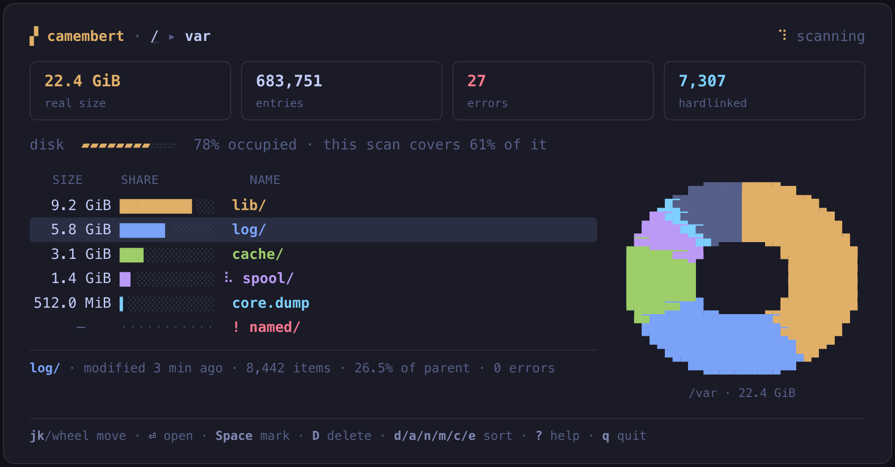

<div align="center">

# 🧀 camembert

**A disk usage analyzer that answers the real questions.**

*What grew? What can I actually free? What is big **and** cold?*

[](https://github.com/Haibread/camembert/actions/workflows/quality.yaml)
[](LICENSE-MIT)
[](https://www.rust-lang.org)

*(camembert is French for pie chart — yes, really)*

</div>

---

Every disk analyzer tells you what is big. **camembert** is built for the
questions you actually have during an incident:

- **What grew since yesterday?** — `camembert diff` two scans, sorted by
  growth, in streaming constant memory (see
  [`camembert diff`](#camembert-diff--what-changed-between-two-scans)
  below).
- **What can I actually free?** — freeable ≠ size: hardlinks are counted
  once and attributed deterministically; deleted-but-open files holding
  disk space are found and shown (see [Freeable](#freeable-deleted-but-open-files)
  below) — btrfs shared extents and hardlink siblings are phase 2, on the
  roadmap.
- **What is big *and* cold?** — size × age, visible at a glance.

And it is **honest about the numbers** other tools get wrong: hardlinks,
sparse files, unreadable directories (counted *and* located, never
silently missing), kernel pseudo-filesystems (`/proc` claims 128 TiB —
camembert never counts it), and mount boundaries (crossed by default, with
the gauge saying so plainly once a scan spans more than one filesystem).

## The interface

A **dashboard cockpit** you can navigate *while the scan runs* — totals
fill in and re-sort live, and the donut wheel's slices grow in real time:

<div align="center">
  

  *Illustrative render, not a live capture — the numbers are synthetic
  (see [tui-design.md](docs/design/tui-design.md#readme-hero-image)).*
</div>

The wheel is a real pie chart drawn in your terminal with sub-cell
pixels — sextants (2×3 per cell) on modern terminals, half-blocks
everywhere else. Each of the top children gets an **identity color**:
the same color paints its table row, its proportion bar, and its slice,
so your eye links them instantly. The palette is Tokyo-Night-family
truecolor with a full fallback ladder (256 → 16 → mono/ASCII) and
[`NO_COLOR`](https://no-color.org) support.

Everything you see is also clickable: table rows, wheel slices, the
breadcrumb, the errors card (see [Mouse](#mouse-interactive-mode) below)
— the keyboard map stays complete either way.

Table bars and the donut ease into position over ~150ms on navigation or
a sort keypress — never longer, and a scan's own live growth is left
alone (it already updates continuously). `--no-motion` (env `NO_MOTION`,
any value counts, even empty — same rule as `NO_COLOR`) disables this:
everything then snaps straight to its target value. Below 100 columns
the side wheel panel has nowhere to go, so a compact mini-donut takes
over the header line instead (not a click target, unlike the full
panel); `z` toggles **zen mode** — table only, no cards/gauge/wheel.

Once the scan completes, a quick `/proc` sweep looks for files a process
is still holding open after every path to them was deleted — space `df`
counts but no directory tree can show you. When it finds enough to be
worth mentioning (≥ 100 MiB **and** ≥ 1% of the filesystem), the disk
gauge grows a clickable "· X.X GiB freeable" suffix and a one-time toast
points at `f`, which opens a scrollable panel: each file's last-known
path, the holding process(es), and its size. See
[Freeable](#freeable-deleted-but-open-files) below for exactly what this
does and doesn't cover.

Three themes are available with `--theme`/env `THEME`: `tokyo-night`
(default), `light` (a Tokyo-Night-"day"-style variant for a light
background) and `high-contrast` (avoids mid-greys, usable on either
background). Errors stay the same coral family and the amber signature
accent stays recognizably amber in every theme. Pick a light terminal
and never say a word about it: an OSC 11 background query at startup
auto-selects `light` when nothing else chose a theme — see
[Configuration](#configuration) for the full precedence and the
`camembert.toml` config file.

## Install

From source (Rust stable, edition 2024):

```bash
git clone https://github.com/Haibread/camembert
cd camembert
cargo install --path camembert
```

### Prebuilt binaries

Static musl binaries for `x86_64` and `aarch64` Linux are attached to every
[GitHub Release](https://github.com/Haibread/camembert/releases):

```bash
# pick one:
TARGET=x86_64-unknown-linux-musl
TARGET=aarch64-unknown-linux-musl

VERSION=0.1.0 # match the release tag, without the leading "v"
curl -LO "https://github.com/Haibread/camembert/releases/download/v${VERSION}/camembert-${VERSION}-${TARGET}.tar.gz"
curl -LO "https://github.com/Haibread/camembert/releases/download/v${VERSION}/camembert-${VERSION}-${TARGET}.tar.gz.sha256"

# verify, then unpack
sha256sum -c "camembert-${VERSION}-${TARGET}.tar.gz.sha256"
tar xzf "camembert-${VERSION}-${TARGET}.tar.gz"
```

Each archive contains the `camembert` binary alongside `LICENSE-MIT`,
`LICENSE-APACHE`, and `README.md`.

`camembert --version` embeds the exact commit it was built from (e.g.
`camembert 0.1.0 (abc1234)`), so you can always tell what you're running.

## Quick start

```bash
# Browse a directory interactively (default on a terminal)
camembert /var

# Summary mode: totals + top directories + top files, no UI
camembert /var --no-ui --top 10

# Scan and write a dump — the interchange format everything builds on
camembert /var -o today.cmbt

# THE feature: what changed between two scans?
camembert diff yesterday.cmbt today.cmbt

# Monitoring probe: exit 1 if growth exceeds the threshold
camembert diff yesterday.cmbt today.cmbt --threshold 500M --json

# Already have ncdu exports? Bring them along — no rescan needed
camembert import old-ncdu-export.json -o old.cmbt
camembert diff old.cmbt today.cmbt

# Filter the summary to what matters (see Filtering below); a bad query
# exits 2 with every parse error, before wasting time on a scan
camembert /var --no-ui --filter '*.log >100M !older:1y'
```

Every option is also an environment variable: `SCAN_PATH` (the directory
to scan, positional otherwise), `THREADS`, `ONE_FILESYSTEM`,
`STATX_ENGINE`, `TOP`, `NO_UI`, `OUTPUT`, `FILTER`, `COLOR`, `THEME`,
`NO_MOTION`, `NO_PROC_SWEEP`, `NO_FIEMAP`, `LOG_FILTER`, `LOG_FILE` for
the scan mode, plus `JSON_OUTPUT` and `THRESHOLD` for `camembert diff`
(see [`camembert diff`](#camembert-diff--what-changed-between-two-scans)
below) — see `camembert --help` and `camembert <subcommand> --help` for
the full reference, including the interactive key map and the diff JSON
schema.

| Flag | Env | What it does |
| --- | --- | --- |
| `--threads` | `THREADS` | scan worker threads (`0` = auto, media-adaptive: see below) |
| `--one-filesystem` | `ONE_FILESYSTEM` | stay on the scan root's filesystem, stopping at mount points, instead of the default of crossing them (kernel pseudo-filesystems are always excluded either way; also avoids multiply-counting btrfs snapshot subvolumes) |
| `--statx-engine` | `STATX_ENGINE` | **experimental** — stat engine: `auto` (io_uring for ≤ 2-worker scans, probed, sync otherwise), `sync`, `io_uring` (see below) |
| `--top` | `TOP` | entries in the summary's "top directories" **and** "top files" (D5) lists — one flag, two lists; the interactive `t` mode's own cap is the separate `flat_cap` config key |
| `--no-ui` | `NO_UI` | summary mode: scan to completion, print totals, top directories, top files, no TUI |
| `-o`/`--output` | `OUTPUT` | write a `.cmbt` dump once the scan completes (`-` = stdout); **never** filtered |
| `--filter` | `FILTER` | filter query — see [Filtering](#filtering); strict parse in `--no-ui` (exit 2 on error), inert-broken-terms pre-apply in interactive mode |
| `--color` | `COLOR` | `auto`/`always`/`never` |
| `--theme` | `THEME` | `tokyo-night`/`light`/`high-contrast` |
| `--no-motion` | `NO_MOTION` | disable bar/donut easing animations |
| `--no-proc-sweep` | `NO_PROC_SWEEP` | disable the freeable `/proc` sweep (gauge suffix, `f` panel, toast, pre-deletion open-file check) |
| `--no-fiemap` | `NO_FIEMAP` | disable the freeable-2 selection oracle (mark-time reclaim estimate) and the ambient exclusive floor (in-bar bright segment, card figure) — see [Reclaim oracle](#reclaim-oracle-freeable-phase-2) |
| `--log-filter` | `LOG_FILTER` | `tracing` filter directive |
| `--log-file` | `LOG_FILE` | write diagnostics to a file instead of discarding them |

`--threads 0` (the default) picks a worker count from the scan root's
backing device, probed once per scan:

- **non-rotational** (SSD/NVMe): `min(cores, 16)` — parallel readers help;
- **rotational** (spinning disks): `2` — more workers just adds seek
  thrashing;
- **undetectable** (network filesystems, unreadable sysfs, no matching
  mount, a `tmpfs`/`overlay` source): `min(2x cores, 8)`, the historical
  safe default.

Filesystems that report an anonymous device number with no direct sysfs
node — btrfs, notably — aren't automatically "undetectable": camembert
resolves the covering mount's real backing device from
`/proc/self/mountinfo` (e.g. `/dev/nvme0n1p2`) and probes *that* instead.
A **multi-device btrfs** volume (RAID0/1/10 across several disks) is
classified from whichever single member device the mount table happens
to report, so a volume mixing an SSD and an HDD can be misjudged either
way — a precise per-member check is a possible future refinement.

An explicit `--threads`/`THREADS` value always overrides this and skips
detection. The decision is logged at `info` level (`media=ssd`,
`media=hdd (sda rotational)`, `media=ssd (btrfs via /dev/nvme0n1p2)`,
`media=unknown (...)`).

Per-entry metadata (`statx`) is fetched by one of two engines, chosen
once per scan and logged at `info` level (`statx=io_uring` /
`statx=sync`):

- **io_uring** (kernel ≥ 5.6): each worker batches up to 1024 `statx`
  calls per `io_uring_enter` through its own ring. The kernel services
  most of them on its io-wq worker threads, which is extra parallelism
  when scan workers are scarce — measured 12–21 % faster warm-cache
  scans at 1–2 workers — but pure scheduler contention once the workers
  already saturate the cores (measured ~25 % *slower* at 16 workers);
- **sync**: one `statx` syscall per entry (with an `fstatat` fallback on
  kernels without `statx`). Always available, supported forever.

`--statx-engine auto` (the default) therefore uses io_uring only for
low-parallelism scans (2 workers or fewer — notably the rotational-media
thread policy) and plain syscalls otherwise; the heuristic is
warm-cache-derived and may be retuned as cold-cache data comes in. Auto
probes io_uring once at scan start and falls back to `sync` wherever it
is denied — default-seccomp Docker, gVisor, the
`kernel.io_uring_disabled` sysctl, kernels older than 5.6. A scan never
fails because io_uring is unavailable, and results are identical
whichever engine runs; only speed can differ. Forcing `io_uring` on a
machine that denies it also falls back (with a warning) rather than
fail. **This knob is experimental**: it exists for tests, benchmarks,
and diagnostics, and may change or disappear once the automatic choice
has proven itself.

## Keys (interactive mode)

| | |
| --- | --- |
| `↓`/`j` `↑`/`k` | move · `⏎`/`l` open (flat mode: jump to the containing directory) · `⌫`/`h` up (tree only) · `g`/`G` ends |
| `d` `a` `n` `m` `c` `e` | sort: disk (default) · apparent · name · mtime · items · **errors** (again = reverse) — keys with no meaning in the active mode flash instead of applying (see [Flat view & pattern breakdown](#flat-view--pattern-breakdown)) |
| `p` | toggle the apparent-size column |
| `t` `b` | flat top files across the whole scan · pattern breakdown (press again to return to the tree) |
| `Space` `u` `D` | mark for deletion (tree/flat rows; not breakdown) · clear marks · delete (confirm with `y`) |
| `v` | review marked entries: a scrollable list, `Space` unmarks a row, `D` deletes from there too |
| `f` | freeable files: deleted-but-open files still holding disk space (`f`/`Esc` closes) |
| `Ctrl-K` / `/` | open the filter/command palette — see [Filtering](#filtering) |
| `?` | keyboard/mouse cheatsheet (`?`/`Esc` closes) |
| `z` | toggle zen mode: table only — no metric cards, disk gauge or donut wheel |
| `Esc` | close the palette, else a modal, else leave a flat/breakdown mode, else clear an active filter, else go up one directory like `Left` (contextual — never quits; quitting is `q`/`Ctrl-C`) |
| `q` | quit unconditionally (cancels a running scan); inside the palette, only `Ctrl-C` quits — every other key, `q` included, is text |

**Deletion is guarded**: mark-then-confirm, mount points refused, every
entry re-checked (existence, file type, device) immediately before
removal — anything that changed since the scan is skipped, never
deleted. Symlinks are removed, never followed. Before the confirmation
dialog opens, a fresh (unless `--no-proc-sweep`) `/proc` check looks for
processes still holding the marked selection open — a marked *file*'s own
`(dev, ino)`, and for a marked *directory*, any open file found anywhere
underneath it (so marking a data directory whose individual files are
what's actually held open still warns, not just marking the file
directly) — and adds an advisory line naming the busiest few. It never
blocks `y`, and says so plainly when it could only see part of the
process table rather than staying silent (the same caveat also covers a
process in a different mount namespace whose open-file path doesn't
textually match the marked directory). The same dialog also carries the
[reclaim oracle](#reclaim-oracle-freeable-phase-2)'s quantified
exclusive/shared/unfreeable byte estimate once it has finished mapping
the selection's extents (started the instant each entry was marked).

While at least one entry is marked, a one-line **basket strip** appears
above the footer (count + total size) — it disappears again once nothing
is marked, so browsing without ever marking anything never sees the
layout shift. **Toasts** in the top-right corner announce things that
*happened* rather than input being validated — a dump written, a
deletion finishing (with the space freed), the scan itself finishing
while you keep browsing, and (once, when it clears the threshold) how
much is freeable by closing files — stacking and auto-dismissing after a
few seconds; they never cover the delete-confirmation dialog. Ordinary
keypress feedback (mark refusals, "nothing marked") stays a quick footer
note instead, right next to the key hints it explains.

## Mouse (interactive mode)

Mouse support is additive — every key above keeps working, nothing
requires the mouse:

| | |
| --- | --- |
| Click a row | select it |
| Click it again, or double-click any row | open it (like `⏎`) |
| Wheel over the table | scroll the cursor |
| Click a donut slice | open that child directly |
| Click a breadcrumb segment (header) | jump to that ancestor (like `⌫` repeated) |
| Click the `errors` metric card | sort by subtree error count (like `e`) |
| Move the mouse over a row | update the selection card below the table, without moving the keyboard cursor |

Moving the keyboard cursor reclaims the selection card from the mouse.

## Flat view & pattern breakdown

Two extra table modes, toggled in place — cards, gauge, basket strip and
footer all stay put; only the table (and the donut) change:

- **`t` — flat top files**: the largest regular files across the *whole*
  scan, out of the directory hierarchy — path (abbreviated like the
  breadcrumb), size, a `⛓` badge on multi-link (hardlinked) files.
  Truncated past `flat_cap` entries (default 1000), which the mode header
  says plainly rather than silently dropping the tail.
- **`b` — pattern breakdown**: named groups (`node_modules/`, `*.log`, …)
  with their total size, entry count and share of the scan, plus a
  trailing `(uncategorized)` row for everything matched by no group.

Both work **during the scan**, badged "provisional" (same idea as the
hardlink note): the live numbers come from an incremental accumulator, not
a full tree walk, so they cost effectively nothing extra. Flat rows show
their basename right away, live — only the *full path* widens in once the
scan completes (a live path would need walking the frozen arena, which
isn't shareable with the UI thread mid-scan). Once the scan completes,
the exact figures take over — and are recomputed immediately after every
deletion, even one performed from *inside* one of these modes, so a
just-deleted file or group member never lingers on screen looking like it
still occupies space.

`⏎` on a flat row jumps straight to its containing directory in the tree
view, cursor on the file; `Space` marks/unmarks a flat row into the same
deletion basket tree rows use — real files, real node ids, nothing
special-cased in the delete/review/confirm path. Breakdown rows aren't
markable (a pattern group isn't a single file) and `⏎` on one is a no-op
for now — group-level actions ("delete every `node_modules`") are a
deliberate fast-follow: the filter query language ([below](#filtering))
finds the matches, but bulk-marking an entire match set in one keystroke
is a separate feature, not yet built (today you mark file-by-file, or a
directory whose *entire* subtree you want).

**The one honest paragraph on how groups are counted (D1):** patterns are
a **disjoint partition**, not overlapping tags — every byte counts in *at
most one* group, so the list and the donut always tell the same story and
never sum past 100%. A directory matching a dir-pattern (`node_modules/`)
claims its *entire* subtree for that group; nothing nested inside it —
another `node_modules`, a `.git`, a `*.log` file — gets re-counted into
its own group, it stays with the outer match. Among patterns that could
match the same name, list order decides: built-in presets first, then
`camembert.toml`'s `[patterns]` in file order.

The donut mirrors whichever mode is active: breakdown mode is the
"category camembert" (one slice per group, plus a gray uncategorized
slice sized to exactly what the list's own trailing row shows — never an
overlap artifact, by construction); flat mode slices the top files, with
everything below the usual small-slice threshold (including the vast
majority of a large scan not in the top-N at all) merged into one gray
"others" wedge so the wheel stays a picture, not a haze of slivers.

Pattern configuration (presets + `[patterns]` + `flat_cap`) lives in
`camembert.toml` — see [Configuration](#configuration) below.

## Filtering

`Ctrl-K` (or `/`) opens the palette: a floating input over the tree. Type
a query — it parses live and applies to the whole cockpit (tree table,
donut, metric cards) as you type, debounced ~100ms so a fast typist never
triggers one fold per keystroke. A leading `>` switches the same box to
fuzzy command search (every keyboard shortcut, by name); `/` always opens
pre-scoped to the query side — there is only ever one palette, one
history, one Esc.

**While the palette is open, it owns the keyboard**: every printable key,
including `q`, is a character — only `Esc` (close), `Enter` (commit),
the arrows/`Home`/`End`/`Backspace`/`Delete` (edit/navigate), and `Ctrl-C`
(quit) are interpreted specially. Filtering only ever runs **after the
scan completes** — mid-scan the query box shows "filter available once
the scan completes" (command mode still works, since it needs no arena).

### Grammar

A query is whitespace-separated **terms**, implicitly ANDed; any term can
be negated with a leading `!`:

| term | meaning |
| --- | --- |
| `report` | bare word: substring match on the basename, ASCII-smartcase (all-lowercase input is case-insensitive; any capital makes it byte-exact) |
| `"q(1).log"` | double-quoted: **literal** byte substring, case-sensitive — the escape hatch for names containing syntax characters (`\"` and `\\` are the only recognized escapes) |
| `*.log`, `data?` | contains `*`/`?`: basename glob (same dialect as pattern breakdown — `{`/`[` are literal, not classes) |
| `node_modules/` | trailing `/`: ancestor constraint — matches entries under a directory whose name matches the glob (the scan root itself is not an ancestor-matchable name) |
| `>100M`, `<1G` | size sugar on **disk** bytes (only when the sigil is immediately followed by a digit — `>readme` stays a substring) |
| `older:6mo`, `newer:2w` | mtime age; units `h`/`d`/`w`/`mo` (30.44 d)/`y` (365.25 d) — `older:` means *not modified since*, **not** "not read since" (this tool never reads atime; a `relatime`-mounted filesystem's own atime is unreliable anyway) |
| `kind:file`, `kind:dir`, `kind:symlink` | entry kind (`kind:dir` only matches *not-descended* directory entries — excluded mounts, stat-failed stubs — scanned directories are structure, never candidates) |
| `ext:log` | sugar for `*.log` (literal suffix, byte-exact) |
| `is:hardlink`, `is:error`, `is:excluded` | node flags |
| `!term` | negation of any term above |

Reserved for a future expression grammar (grouping, OR, value lists): `(`
`)` `;` `|` outside quotes are rejected with an error naming the feature;
`<`/`>` are **not** reserved (already spent on size sugar). `user:`/
`group:` parse but error — ownership isn't retained by this scan (a
future retention change, not a parser gap).

**Errors never block typing**: a broken term is *inert* — every other
term in the query still applies — and its problem (span + message) shows
inline under the input as you type, dimmed. Only `--filter` (below) is
strict.

**Hardlinks match by any path**: a query naming `*.bak` finds a 50 GiB
`backup.bak` even when the byte-counted (canonical) link lives elsewhere
under a different name — the matching non-canonical link shows up as a
`⛓` row, 0 bytes, "counted at its canonical path" (a filter that can name
a file and report it *absent* would be exactly the dishonest number this
tool exists to avoid).

### The pill and composition

An active filter shows a persistent one-line **pill** above the basket
strip: the query text, matched entries + bytes, the dir-inode residual
("+N GiB in M directory inode(s) not counted" — directories' own inode
bytes can never match any query, shown whenever nonzero rather than
leaving an unexplained gap against the scanned total), and "Esc clears".
A spinner replaces the bullet while a fold is still computing.

With a filter active: the tree table shows only matching rows (a
directory only when its filtered subtree still has a match; its total
becomes the *filtered* subtree total, not the raw one) — the currently
viewed directory itself always renders, even at zero matches, as a
legitimately empty table, never an auto-navigate-away surprise. `t`/`b`
compose the same way, over the match set, never the whole scan. The
freeable panel/gauge are untouched by any filter (they describe a
different, process-level fact).

**Directory marks are refused while a filter is active** ("directory
marks are disabled while a filter is active — clear the filter first") —
a filtered directory row shows only its matches, so marking it would
delete everything underneath, matched or not. File marks are unaffected.

### History and saved queries

Every committed query is recalled with `Up`/`Down` inside the palette,
persisted to `$XDG_STATE_HOME/camembert/history` (falling back to
`~/.local/state/camembert/history`), one query per line, newest last,
bounded to 200 entries, written atomically (temp file + rename) — the
first thing this otherwise read-only-config tool ever writes to disk on
its own. A read/write failure there is logged and otherwise ignored; it
never interrupts browsing.

`camembert.toml`'s `[queries]` table holds read-only saved queries, shown
in the palette (with their labels) whenever the query box is empty:

```toml
[queries]
big_logs = "*.log >100M"
stale = "older:1y"
```

### `--filter` (CLI, env `FILTER`)

Same grammar, two modes:

- **Interactive**: pre-applies the instant the scan completes, exactly as
  if typed into the palette and committed — broken terms are inert, same
  as above.
- **`--no-ui` summary**: the top-directories/top-files lists are computed
  over the match set, plus a "matched: … of … scanned" totals line. The
  parse here is **strict** — any unparseable term prints every error and
  exits **2** without scanning, so a typo in an automated script is never
  silently ignored.

`-o`/`--output` dumps are **never** filtered, in either mode — a dump is
the whole scan, always; filtering is a view, not a subset export.

## Freeable (deleted-but-open files)

A process can `unlink` a file and keep writing to it: the name is gone,
`du` (and camembert's own tree) has no path left to attribute the space
to, but the inode's blocks stay allocated until the last open descriptor
closes — the classic "`df` says full, `du` says empty" gap. Once the scan
completes, camembert runs one `/proc` sweep looking for exactly these
files (skippable with `--no-proc-sweep`/`NO_PROC_SWEEP`, e.g. for
containers with a masked `/proc`) and surfaces what it finds through the
disk gauge's suffix, a one-time toast, and the `f` panel (evidence path,
holder PID(s) and process name, allocated size, grouped display-only
under the deepest still-existing directory).

**What this covers, precisely — and what it does not** (phase 1; btrfs
shared extents and hardlink siblings are phase 2):

- **Scope**: only files on the **scan root's own filesystem** count
  toward the gauge and the toast threshold — the same filesystem the
  disk gauge itself describes, so the number is always a coherent
  subset of "used". Since crossing filesystem boundaries is the default
  (`--one-filesystem` opts out), files held open on *other* crossed
  devices still appear in the panel, labeled by device, but are never
  added to the gauge.
- **btrfs multi-subvolume layouts**: several subvolumes mounted as
  separate `st_dev`s can share one underlying block pool. Because scope
  is decided by `st_dev`, a deleted-open file on a sibling subvolume
  outside the scan root is invisible to this sweep — a known
  under-count on that layout, not a silent one: the panel says so.
- **mmap-only holders**: a process that `mmap`ed the file and closed its
  file descriptor keeps the inode alive with no entry in
  `/proc/[pid]/fd` — seeing that requires `/proc/[pid]/map_files`, which
  needs `CAP_SYS_ADMIN`. Phase 1 does not attempt it; such holders are
  invisible.
- **RAM-backed, not disk**: `memfd`/POSIX or SysV shared memory/tmpfs
  inodes are real allocations, but of RAM, not the scanned disk. They
  are never folded into the freeable total — the panel reports them as
  one separate "N RAM-backed (memfd/shm), not disk space" line instead,
  so they read as a distinct fact rather than a suspiciously-round
  coincidence.
- **Process-table coverage**: reading another user's `/proc/[pid]/fd` is
  permission-gated. When the sweep could not read every process, the
  panel (and the pre-deletion advisory, D6) say "N of M processes
  readable — run as root for the full view" instead of staying quiet —
  an absent warning must never be mistaken for a clean bill of health.
- **Nothing here reaches a dump.** Open-file state is process state,
  stale the instant the sweep finishes; a `.cmbt` dump loaded later has
  no ledger at all — the hint lives in the live TUI only.

## Reclaim oracle (freeable phase 2)

Deleting a selection doesn't always free `Σ disk`: on extent-sharing
filesystems the same physical bytes can back a `cp --reflink` copy or a
snapshot outside the selection, and hardlinked files only free anything
once *every* link is gone. camembert answers this per-selection, honestly
bucketed rather than as one optimistic number:

- **Marking is the trigger.** The instant you mark a file or directory
  (`Space`), camembert starts mapping its extents off the UI thread — by
  the time you press `D`, the answer is usually already there.
- **The `D` confirmation dialog** replaces the old "N hardlinked files"
  sentence with a quantified line once every marked entry's mapping has
  landed: `frees ≥ X exclusive` (guaranteed, understates rather than
  overstates), `+ up to Y shared only within the marked set` (freed only
  if the *whole* selection goes), `Z shared elsewhere will not be freed`
  (pinned by something outside the selection — a snapshot, another
  hardlink, an unscanned file), and `W not estimated` (delalloc or
  unmapped — never guessed into a bucket). While mapping is still running
  for any marked entry, the dialog shows a spinner
  ("estimating actual reclaim…") instead and **updates in place** the
  moment the last one lands; `y` deletes on whatever is known at that
  instant, waiting is never required.
- **Units are allocated-logical bytes** — the same unit as the `disk`
  column (`Σ fe_length`, not the physical on-disk footprint). On a
  `compress`-mounted filesystem the real reclaim can be smaller than the
  figure shown; the dialog adds a caveat line when any marked file sits on
  one, since the kernel doesn't expose compressed byte counts to an
  unprivileged FIEMAP call.
- **Filesystem tiers**: btrfs and XFS get the full extent-aware oracle
  (`FS_IOC_FIEMAP`, no root required). ext4 and every other filesystem
  without reflink get an exact hardlink-only figure (`disk` *is*
  exclusive there — no extent claims needed). ZFS shows nothing at all,
  by design: block cloning is pool-level with no per-file API, so even
  the hardlink-only tier could be wrong — no figure beats a guess.
- **Kernel ≥ 6.1**: `FIEMAP_EXTENT_SHARED` is only trusted from the btrfs
  backref rewrite onward; on an older kernel the oracle still runs, with a
  caveat that the exclusive figure may overstate under concurrent writes.
- **`--no-fiemap`/`NO_FIEMAP`** disables the oracle outright — no job ever
  spawns, no `FS_IOC_FIEMAP` call is ever made, and the confirmation
  dialog falls back to the phase-1 hardlink-only wording. Same shape as
  `--no-proc-sweep`: flag/env only, no `camembert.toml` key. Also
  disables the ambient exclusive floor below.

### Ambient exclusive floor

Where the oracle above answers "what does *this marked set* free, exactly,
right now", the floor answers the ambient question — visible before you
mark anything at all — of how much of every directory is provably
non-shared:

- **The bright segment inside each row's bar** is the row's guaranteed-at
  -least-this-much-exclusive share: a brighter shade of the row's own
  identity color (never a second color), sized to the fraction of the
  row's bytes the floor can prove nobody else references. It is
  *additive* — unlike the oracle's per-selection figures, floor bytes are
  counted once, filesystem-wide, so directory totals never double-count
  what their children already claimed.
- **The selection card** adds a matching line once a directory or file is
  selected: `excl ≥ X · mapped Y ago` for a nonzero floor, or `fully
  shared · mapped Y ago` when the floor is exactly zero on a nonzero-size
  entry — zero is a real, informative answer here, never hidden as if
  there were nothing to say. A trailing caveat line appears when it
  applies: a `compress`-mounted device (physical reclaim may be smaller
  than the logical figure) or unmapped files (the floor understates by at
  least their bytes).
- **"mapped … ago"** is honest about staleness: the pass runs once, off
  thread, right after the scan (and the phase-1 `/proc` sweep, if one
  runs) completes, and again after every in-app deletion — but external
  filesystem writes, snapshots, or dedup runs between passes are not
  watched. The timestamp says exactly how old the figure is so you can
  judge that yourself.
- **Same honesty contract as the oracle**: allocated-logical bytes, `≥`
  and "fully shared" wording only, never "you will free exactly X".
  Kernel ≥ 6.1 gated the same way (unlike the oracle, which still runs
  with a caveat on older kernels, the floor simply never runs at all
  below 6.1 — no partial/unreliable figure is worth showing ambiently).
- **`--no-fiemap`/`NO_FIEMAP`** disables the floor together with the
  oracle: no background pass, no bright segment, no card line.

## Error reporting

A failed read is never just a number. camembert preserves the **errno**
of every failing directory read and stat, end to end — scan → tree →
dump → TUI — because severity matters: `EACCES` is benign ("rerun as
root"), `EIO` means the disk may be failing and must never be buried,
`ESTALE` is a broken network mount, `ELOOP`/`ENOENT` are noise.

- **Selection card** — a row that failed its own read (an unreadable
  directory, or an entry whose stat failed) shows the reason inline, e.g.
  `⚠ EACCES — permission denied · subtree partly unscanned, size shown is
  a floor`. An unreadable directory's subtree is unknown, so its size is a
  floor, not a total.
- **Errors card breakdown** — once the scan finishes, a one-line
  per-errno breakdown appears under the metric cards, ordered by
  **severity class first** (a single `EIO` outranks thousands of benign
  `EACCES`), not by count: `by reason  EIO 12 · EACCES 3390 · ELOOP 2`.
  Coloured by severity; hidden in zen mode (`z`) like the cards. Sort the
  table by subtree error count with `e` (or by clicking the errors card).
- **Dumps** — `.cmbt` dumps carry the reason as a portable name in the
  optional `er` field (`"EACCES"`, `"EIO"`, …; a raw number for exotic
  errnos), an additive **minor-1** field readers of older minors ignore.
  It survives a write→read round trip and repopulates the tree's error
  side-table. See [the dump spec](docs/format/dump-v1.md) §6.2/§6.4.

A directory whose listing was cut short mid-read (a `getdents` failure
after some entries) is counted in the error total but has no single node
to attribute an errno to, so it is not broken out by reason — every
error that maps to a node is.

## Configuration

Beyond flags and environment variables, camembert reads an optional TOML
config file at `$XDG_CONFIG_HOME/camembert/camembert.toml` (falling back
to `~/.config/camembert/camembert.toml` when `XDG_CONFIG_HOME` is unset).
A missing file is perfectly fine — nothing here is required. All keys are
optional:

```toml
theme = "tokyo-night"  # "tokyo-night" | "light" | "high-contrast"
color = "auto"         # "auto" | "always" | "never"
no_motion = false      # true disables micro-animations
flat_cap = 1000        # flat top-files cap (t mode); default shown

[patterns]             # label = "glob" — file order is precedence order,
                        # after the built-in presets (node_modules/, .git/,
                        # target/, __pycache__/, .cache/, .venv/, *.log,
                        # *.tmp); a label reused from a preset replaces it
                        # in place instead of adding a duplicate entry.
logs = "*.log"
build = "dist/"         # trailing "/" = a directory pattern (D1: claims
                        # the whole matched subtree, see the flat-view
                        # section above)

[queries]               # label = "query string" — read-only saved
                        # filters, shown in the Ctrl-K/`/` palette when
                        # its input is empty; see Filtering above.
big_logs = "*.log >100M"
stale = "older:1y"
```

Pattern syntax (D4): a basename glob against one path component at a
time — never a full path. Only `*` (zero or more bytes) and `?` (exactly
one byte) are special; every other character, **including `{`, `}`, `[`,
`]`**, is matched *literally* (`core.[0-9]` only matches a file actually
named `core.[0-9]`, it is not a character class). A trailing `/` marks a
directory pattern; without one, the pattern matches non-directory entries
only.

An unparseable file (broken TOML syntax) is never fatal: camembert warns
(visible with `--log-file`) and falls back to defaults entirely. Beyond
that, parsing is **per-key resilient** — an invalid `theme`, a bad
`flat_cap`, or a malformed `[patterns]`/`[queries]` entry (or the whole
table, if it isn't one) is warned about and defaulted **on its own**,
without resetting the theme, the color mode, or any pattern/query entry
that *did* parse. An invalid glob spec is likewise skipped with a
warning, never fatal; the interactive UI additionally shows a one-time
startup toast ("N invalid patterns ignored — see log") when any pattern
(config-level or glob-compile) was dropped.

**Precedence**, for each of `theme`/`color`/`no_motion` independently: the
matching **CLI flag > its environment variable > `camembert.toml` > built-in
default** — `--theme`/`--color`/`--no-motion` beat `THEME`/`COLOR`/
`NO_MOTION`, which beat the config file, which beats `tokyo-night`/
`auto`/motion-enabled. `flat_cap`, `[patterns]` and `[queries]` are
config-file only — no CLI flag or environment variable (`--filter`/
`FILTER` is a separate, one-shot query — see [Filtering](#filtering)).

`theme` gets one more step between the config file and the default: an
**OSC 11 terminal background query**. At startup, before the alternate
screen opens, camembert asks the terminal for its background color and
waits up to ~150ms for an answer; if the reported color's relative
luminance is above 0.5, the `light` theme is auto-selected. This only
ever runs when nothing above it (flag, env var, config file) already
picked a theme, is skipped outright on a non-terminal or `TERM=dumb`,
and treats "no answer in time" as dark — the same look as before this
feature existed. It can never block longer than the timeout and never
consumes more than that narrow slice of stdin.

## The dump format

`.cmbt` dumps are **JSON Lines in a seekable zstd container**
([spec](docs/format/dump-v1.md)) — versioned, crash-safe (written to
`.part`, renamed atomically), and readable with stock tools, no
camembert required:

```bash
zstdcat today.cmbt | jq -r 'select(.t == "d") | [.td, .path] | @tsv' \
  | sort -rn | head -5
```

Sibling order is raw-byte sorted, which is what makes `diff` a
streaming merge-join: two 10M-entry dumps diff in megabytes of RAM,
not gigabytes.

## `camembert import` — bring ncdu exports along

```bash
camembert import old-ncdu-export.json -o old.cmbt

# or from stdin (gzip NOT handled — decompress first):
zcat old-ncdu-export.json.gz | camembert import - -o old.cmbt
```

Converts an `ncdu -o` JSON export (ncdu 1.x, minor versions 0–2; newer
minors import with a warning, unknown fields ignored) into a camembert
dump, streamed through a hand-rolled JSON lexer (handles the non-UTF-8
byte sequences pre-2.5 ncdu exports can contain). Hardlinks are
deduplicated and canonically attributed exactly like a fresh scan, and
the result is a first-class **ordered** dump (siblings sorted by raw
name bytes, subtree totals computed) — diffable against anything else,
including a fresh scan of the same tree:

```bash
camembert import old-ncdu.json -o old.cmbt && camembert diff old.cmbt fresh.cmbt
```

| Argument | Env | What it does |
| --- | --- | --- |
| `input` | — | the ncdu JSON export to convert; `-` reads stdin |
| `-o`/`--output` | `OUTPUT` | where to write the camembert dump (`.cmbt`); `-` writes stdout |

**Field mapping** (ncdu → dump): `name` → `n` (raw bytes, re-encoded),
`asize`/`dsize` → `a`/`d`, `ino`/`nlink`/`hlnkc` → `i`/`l` with
`(dev,ino)` hardlink deduplication and canonical smallest-path
attribution, `read_error` → `err`, excluded `otherfs`/`othfs`/`kernfs`
→ a never-scanned directory stub with `ex`, an absent `dev` inherits
the parent's.

**Not carried (documented losses)**:

- `uid`/`gid`/`mode` (ncdu's extended `-e` info) are dropped;
- pattern/`frmlink` exclusion reasons collapse to `ex:"otherfs"`;
- `mtime` is `0` when the export was made without `ncdu -e`;
- the `dev` of a non-hardlinked file is dropped;
- `hlnkc` without `ino` (very old exports) cannot be deduplicated and
  counts fully;
- the ncdu metadata block is ignored (as ncdu itself documents).

**Exit codes**: `0` OK, `2` error (unreadable input, or the dump could
not be written).

## `camembert diff` — what changed between two scans

```bash
camembert diff yesterday.cmbt today.cmbt

# Monitoring probe: exit 1 if growth exceeds the threshold
camembert diff yesterday.cmbt today.cmbt --threshold 500M --json
```

Streams both dumps through a constant-memory merge-join — never loads
either tree into memory, the same property that makes two 10M-entry
dumps diff in megabytes of RAM, not gigabytes (see
[The dump format](#the-dump-format) above) — and reports the total
disk/apparent/entry delta plus every entry's change kind: **added**,
**removed**, **grown**, **shrunk**, **touched** (same sizes, different
mtime), **type-changed** (file ↔ symlink/device/directory).

| Flag | Env | What it does |
| --- | --- | --- |
| `--top` | `TOP` | directories and entries in each top list (default 20) |
| `--json` | `JSON_OUTPUT` | JSON Lines instead of human-readable text |
| `--threshold` | `THRESHOLD` | exit 1 when total disk growth exceeds this size — turns the diff into a monitoring probe |

**Output** (default, human-readable): a summary line (total disk/
apparent/entry delta and change counts), then "Top N directories by
growth" (signed subtree disk delta from the dump totals — canonical
hardlink attribution — biggest growth first, shrinkage negative) and
"Top N entries by growth".

**JSON Lines** (`--json`/`JSON_OUTPUT`), one object per line:

```jsonl
{"t":"summary","oldRoot":S,"newRoot":S,"diskDelta":I,"apparentDelta":I,"entryDelta":I,"added":N,"removed":N,"grown":N,"shrunk":N,"touched":N,"typeChanged":N,"dirsAdded":N,"dirsRemoved":N}
{"t":"dir","path":S,"change":"added|removed|changed","diskDelta":I,"apparentDelta":I,"entryDelta":I}
{"t":"entry","path":S,"change":"added|removed|grown|shrunk|touched|typeChanged","diskDelta":I,"apparentDelta":I}
```

Paths are percent-encoded like dump names (non-UTF-8 bytes as `%XX`);
integers with magnitude ≥ 2^53 are emitted as decimal strings, exactly
like the dump format itself — parse both shapes.

**Monitoring probe**: `camembert diff old.cmbt new.cmbt --threshold 2G`
exits 1 when the tree grew by more than 2 GiB (0 otherwise) without
printing anything beyond the normal report — wire it straight into a
check.

**Exit codes**: `0` OK (and, with `--threshold`, growth within
budget), `1` growth exceeded `--threshold`, `2` error. Both dumps must
be **ordered** (header `"ordered":true` — the default writer output)
and **complete** (their `e` end marker present); an unordered or
truncated dump is refused with exit code 2.

## Honest numbers

- **real** (`st_blocks × 512`, the default) vs **apparent** (`st_size`)
  are both always carried — sparse files and compression make them
  legitimately disagree.
- Hardlinked inodes count **once**, attributed to their canonical
  (smallest-path) link — deterministic across scans, so diffs never
  show phantom growth.
- Unreadable directories never abort a scan and never vanish: the
  summary lists exactly where reads failed, the errno reason is preserved
  end to end (see [Error reporting](#error-reporting)); in the TUI, sort
  with `e`.
- Kernel pseudo-filesystems (`/proc`, `/sys`, cgroups…) are never
  descended into, even though crossing filesystem boundaries is the
  default (`--one-filesystem` restricts a scan to the root's own
  filesystem).
- By default camembert descends into every filesystem mounted under the
  scan root — RAM-backed `tmpfs` and other disks included, since their
  bytes are real usage of *those* filesystems, not phantom totals.
  `--one-filesystem`/`ONE_FILESYSTEM` stops at mount points instead. Three
  known, accepted caveats share one root cause: the mount-boundary check
  only compares a child's `st_dev` against its parent's, which cannot see
  *why* two paths share a device. (1) On btrfs, descending into
  subvolumes also walks snapshot subvolumes (e.g. `.snapshots`), which can
  multiply-count snapshotted data — `--one-filesystem` avoids that too.
  (2) A bind mount whose source is on the same filesystem is descended as
  an ordinary directory, double-counting its subtree — `st_dev` never
  differs across a same-filesystem bind mount, so even
  `--one-filesystem` does not catch it. (3) The same block device mounted
  at two different paths inside the scan is descended twice under the
  default crossing behavior. Hardlink deduplication only catches
  `nlink > 1` files, so `nlink == 1` files and directories still
  double-count in cases (2) and (3). A traversal-dedup pass is planned —
  see the [Roadmap](#roadmap).
- The disk gauge tells you how much of the *occupied* filesystem your
  scan actually covers — a total without context is half a lie. The
  coverage compares the scan's **logical** footprint (`st_blocks`)
  against the kernel's **physical** `used` (statvfs), and those are
  different units on a transparently-compressed mount (btrfs `compress=`):
  logical routinely exceeds on-disk. Rather than clamp that to a
  fabricated "covers 100% of used", the gauge says so plainly — *"scan
  logical exceeds on-disk (compressed mount)"* — so a compressed
  filesystem never makes the bar quietly lie. Once a scan spans more than
  one filesystem (the default, once it actually crosses a mount or hits a
  `tmpfs`), a percentage against the scan root's one statvfs would be just
  as dishonest, so the caption says so instead — *"spans N filesystems ·
  gauge shows the scan root's"* — the bar itself still tracks the scan
  root's own used/capacity, unchanged.
- Freeable (deleted-but-open files) states its scope and its gaps out
  loud — root-filesystem-only, btrfs multi-subvolume under-counting,
  mmap-only blind spot, RAM-backed split — see
  [Freeable](#freeable-deleted-but-open-files).

## Roadmap

Scan engine (including media-adaptive threading and io_uring-batched
statx with a sync fallback), live TUI, dump v1, diff, ncdu import,
guarded deletion, freeable phase 1 (deleted-but-open files), flat view
and pattern aggregation, and the filter query language with a Ctrl-K
command palette are implemented. Freeable phase 2 (both the mark-time
selection oracle and the ambient exclusive floor above) is implemented;
next: group/bulk marking under a filter, per-owner views, remote scan
over ssh, and an HTML report export. Also tracked: per-directory inode
counters with an `f_files` near-limit alert, apparent/real slack
surfacing across small-file masses, quotas (`quotactl`, XFS project
quotas — its own dossier), composable stdout output of the marked
selection (fzf-style, for `rm $(camembert --print …)`), display-only
cleanup recipes for known paths, an age/"big and cold" score view
(size × age — a dossier is in progress), and a traversal-dedup dossier
for the bind-mount/snapshot-subvolume double-counting noted above. The
full design trail lives in [`docs/design/`](docs/design/).

## Development

```bash
cargo test --workspace          # the suite (~518 tests)
pre-commit install              # fmt + clippy -D warnings + hygiene hooks
```

The workspace splits a pure core library
([`camembert-core/`](camembert-core/)) from the TUI/CLI frontend
([`camembert/`](camembert/)); design decisions are recorded in
[`docs/design/`](docs/design/) and are binding. See
[HANDOFF.md](HANDOFF.md) for the current project state.

## License

Dual-licensed under [MIT](LICENSE-MIT) or
[Apache-2.0](LICENSE-APACHE), at your option.
